AB Testing - COMPANY XYZ
================
Michał Makowski

  - [Introduction](#introduction)
  - [Setup and preparation](#setup-and-preparation)
  - [Data quality](#data-quality)
      - [users dataset and Pilot dataset structure
        similarity](#users-dataset-and-pilot-dataset-structure-similarity)
      - [Pilot dataset structure
        similarity](#pilot-dataset-structure-similarity)
  - [Pilot dataset exploration](#pilot-dataset-exploration)
      - [Does campaign work?](#does-campaign-work)
      - [Visual exploration](#visual-exploration)
  - [Training](#training)
      - [Full data, four variables](#full-data-four-variables)
      - [Campaign data, two variables](#campaign-data-two-variables)
      - [Summary](#summary-2)
  - [Predictions](#predictions)

*This is a AB testing project which was done as a test, I removed
sensitive information and decided to publish it. Data is not published,
some of the comments were deleted so it might seems to be unfinished,
but that was done on purpose.*

# Introduction

`deleted information`

The task refers to a case of AB Testing conducted by **COMPANY XYZ**.
The main idea of the testing was to improve a **COMPANY XYZ** marketing
strategy.

`deleted information`

# Setup and preparation

Data was provided in two datasets - **pilot** and **users**. First
contains information about AB testing, second is a database of users on
which predictions should be done. We loaded everything into memory and
briefly checked the structure of the data.

``` r

knitr::opts_chunk$set(results = "hold", message = FALSE, strip.white = TRUE, warning = FALSE)

loadLibraries <- c("tidyverse", "cowplot", "lattice", "GGally", "corrplot", "pipeR", "caTools",
                   "themis", "ranger", "randomForest", "glmnet", "vip",
                   "rsample", "tidymodels", "parsnip", "yardstick", "tune", "dials")

installedLibraries <- loadLibraries[!loadLibraries %in% installed.packages()]

for(lib in installedLibraries) 
    install.packages(lib, dependences = TRUE)

sapply(loadLibraries, require, character = TRUE)
## Warning: package 'tidyverse' was built under R version 4.0.2
## Warning: package 'cowplot' was built under R version 4.0.2
## Warning: package 'GGally' was built under R version 4.0.2
## Warning: package 'corrplot' was built under R version 4.0.2
##    tidyverse      cowplot      lattice       GGally     corrplot        pipeR 
##         TRUE         TRUE         TRUE         TRUE         TRUE         TRUE 
##      caTools       themis       ranger randomForest       glmnet          vip 
##         TRUE         TRUE         TRUE         TRUE         TRUE         TRUE 
##      rsample   tidymodels      parsnip    yardstick         tune        dials 
##         TRUE         TRUE         TRUE         TRUE         TRUE         TRUE

# for replication purposes
# initialSeed   <- as.integer(Sys.time())
# theSeed       <- initialSeed %% 100000
# print(theSeed) # 2137
set.seed(2137)

theme_set(theme_bw()) # ggplot theme
```

``` r
users   <- read_csv("01 Data/users.csv")
pilot       <- read_csv("01 Data/pilot.csv")
decisions   <- read_csv("01 Data/decisions.csv")

# head(users)
# head(pilot)
# head(decisions)

# identical(users, users[complete.cases(users),])
# all(users == users[complete.cases(users),]) # :)
# all(pilot == pilot[complete.cases(pilot),])
# both TRUE
```

``` r
users$V2    <- users$V2 %>% parse_factor(sort(unique(.))) # alphabetical order of factors
users$V11   <- as.integer(users$V11)
users$V15   <- as.integer(users$V15)
users$V18   <- as.integer(users$V18)
users$V19   <- users$V19 %>% parse_factor(sort(unique(.))) # ditto

# str(users)
# summary(users)
```

``` r
pilot <- rename(pilot, campaign = treatment)

pilot$V2    <- pilot$V2 %>% parse_factor(sort(unique(.))) # ditto
pilot$V11   <- as.integer(pilot$V11)
pilot$V15   <- as.integer(pilot$V15)
pilot$V18   <- as.integer(pilot$V18)
pilot$V19   <- pilot$V19 %>% parse_factor(sort(unique(.))) # ditto

pilot$campaign  <- as.logical(pilot$campaign)
pilot$purchase  <- as.logical(pilot$purchase)


# str(pilot)
# summary(pilot)
```

# Data quality

## Users dataset and Pilot dataset structure similarity

As we wanted to build the model on the **pilot** dataset and use the
**users** dataset for predictions, we checked if there are any
significant differences in distributions of variables between those
sets.

*We could had trusted our data provider, but at least simple visual
inspection should be done.*

### Plots

We do not present every plot, as distributions in both groups were
pairwise similar.

``` r
# continuous variables

everyCase <- bind_rows(mutate(users, 
                              AB.testGroup = FALSE),
                       mutate(select(pilot, -campaign, -purchase),
                           AB.testGroup = TRUE))

everyCase %>%
    select(where(is.double)) %>%
    colnames() %>%
    sapply(
        function(X)
        {
            ggplot(everyCase) +
                geom_area(aes(x = get(X), 
                              y = ..density.., 
                              fill = AB.testGroup,
                              colour = AB.testGroup),
                          alpha = 0.25,
                          stat = "bin",
                          bins = 93, # Rice rule
                          position = "identity") +
                labs(x = X) +
                theme(legend.position = c(0.8, 0.8)) -> plot1
                
            ggplot(everyCase) +
                geom_violin(aes(x = AB.testGroup,
                                y = get(X),
                                fill = AB.testGroup),
                            alpha = 0.15) +
                geom_boxplot(aes(x = AB.testGroup, 
                                 y = get(X),
                                 fill = AB.testGroup),
                             alpha = 0.75) +
                labs(y = X) +
                guides(fill = "none") -> plot2
            
            
            plot_grid(plot1, plot2,  rel_widths = c(5, 3))
        },
        simplify = FALSE,
        USE.NAMES = TRUE
    ) -> plotListContinous

plotListContinous$V20
```

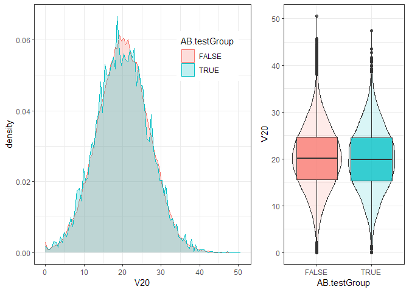<!-- -->

``` r
# discrete variables

everyCase %>%
    select(where(is.integer)) %>%
    colnames() %>%
    sapply(
        function(X)
        {
            ggplot(everyCase) +
                geom_bar(aes(x = get(X), 
                             y = ..prop..,
                             fill = AB.testGroup,
                             colour = AB.testGroup),
                             alpha = 0.4,
                             position = "identity") +
                labs(x = X) +
                theme(legend.position = c(0.9, 0.8)) -> plot1
                
            ggplot(everyCase) +
                geom_boxplot(aes(x = AB.testGroup, 
                                 y = get(X),
                                 fill = AB.testGroup),
                             alpha = 0.75) +
                labs(y = X) +
                guides(fill = "none") -> plot2
            
            plot_grid(plot1, plot2,  rel_widths = c(5, 3))
        },
        simplify = FALSE,
        USE.NAMES = TRUE
    ) -> plotListDiscrete


everyCase %>%
    select(where(is.factor)) %>%
    colnames() %>%
    sapply(
        function(X)
        {
            ggplot(everyCase) +
                geom_bar(aes(x = get(X),
                             y =  ..prop..,
                             group = AB.testGroup,
                             fill = AB.testGroup,
                             colour = AB.testGroup),
                         alpha = 0.25,
                         stat = "count",
                         position = "identity") +
                labs(x = X, 
                     y = "Probability") +
                theme(legend.position = c(0.8, 0.8))
        },
        simplify = FALSE,
        USE.NAMES = TRUE
    ) -> plotListFactor

plotListDiscrete$V15
```

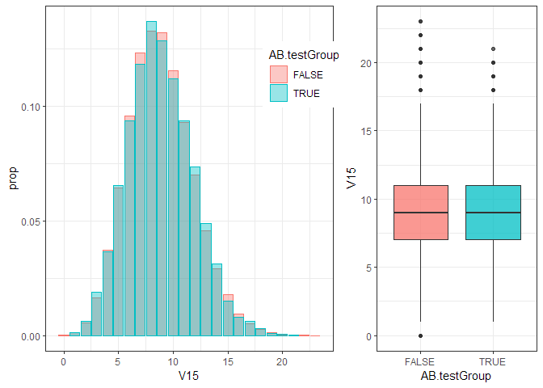<!-- -->

``` r
plotListFactor$V19
```

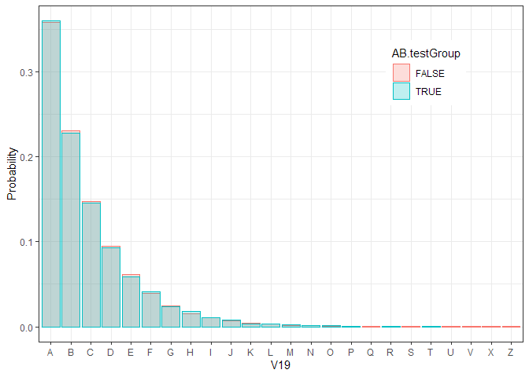<!-- -->

``` r
# table(everyCase$AB.testGroup, everyCase$V2) %>%
#   proportions(1)
# Proportions do not differ to much

# table(everyCase$AB.testGroup, everyCase$V19) %>%
#   proportions(1) 
# Ditto, results do not differ much.
```

The brief introductory analysis showed that both sets (**users** and
**pilot**) are almost similar in terms of variables’ distributions. To
confirm that there could be done more analysis which might reveal some
differences or conditional dependencies. As the task should not dive to
deeply into the problem, we assumed that variables are not highly
correlated (what was somehow proven by plots described in next
paragraph).

Correlation analysis is quite useful when we want to interpret results
and add some **domain** knowledge to the problem. Scatter plots are
great tools for that, they can be produced by **pairs** or **ggpairs**
functions. In our case they will produce \(\sim20^2/2 - 20 = 180\)
plots, each of which should be plotted for both datasets, what gives
over 300 plots…

``` r
# filter(everyCase, AB.testGroup == FALSE) %>%
#   ggpairs()

# filter(everyCase, AB.testGroup == TRUE) %>%
#   ggpairs()
```

### Tests

The Kolmogorov-Smirnov test was conducted to confirm the visual
analysis.

``` r
everyCase %>%
    select(where(is.numeric)) %>%
    colnames() %>%
    sapply(
        function(X)
        {
            ks.test(
                everyCase %>%
                    filter(AB.testGroup == TRUE) %>%
                    pull(X),
                everyCase %>%
                    filter(AB.testGroup == FALSE) %>%
                    pull(X)
                )$p.value
        }
    ) %>%
    {
        Filter(function(x) x <= 0.05, .)    # Bonferonni correction might be applied 
    }                                       # (level of significance/number of tests)
```

    ##        V7 
    ## 0.0186037

There is no strong evidence that the data in both groups comes from
different distributions (pairwise).

### Summary

A similarity of the datasets guarantee that models builds on the
**pilot** dataset should work properly on the **users** dataset (of
course only if that will be train properly). If there will be outliers,
missing values and other artifacts in one of the sets there should be
some feature engineering done prior to next step.

*In practice we rarely observe such clean data, but the task dataset
almost surely comes from simulation. In real problems statistical tests
might not be that useful, or are harder to use.*

## Pilot dataset structure similarity

Likewise, the structure of the **pilot** dataset was briefly analyzed.
The motivation is the same as in last paragraph.

### Plots

``` r
pilot %>%
    select(where(is.double)) %>%
    colnames() %>%
    sapply(
        function(X)
        {
            ggplot(pilot) +
                geom_area(aes(x = get(X), 
                              y = ..density.., 
                              fill = campaign,
                              colour = campaign),
                          alpha = 0.25,
                          stat = "bin",
                          bins = 34, # Rice rule
                          position = "identity") +
                labs(x = X) +
                theme(legend.position = c(0.8, 0.8)) -> plot1
                
            ggplot(pilot) +
                geom_violin(aes(x = campaign,
                                y = get(X),
                                fill = campaign),
                            alpha = 0.15) +
                geom_boxplot(aes(x = campaign, 
                                 y = get(X),
                                 fill = campaign),
                             alpha = 0.75) +
                labs(y = X) +
                guides(fill = "none") -> plot2
            
            
            plot_grid(plot1, plot2,  rel_widths = c(5, 3))
        },
        simplify = FALSE,
        USE.NAMES = TRUE
    ) -> continousPlotList

continousPlotList$V20
```

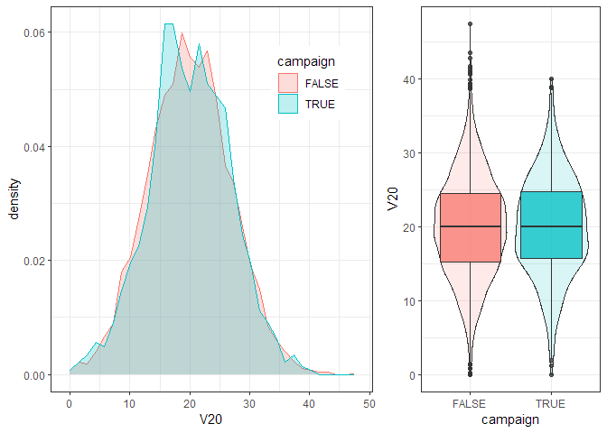<!-- -->

``` r
# discrete variables

pilot %>%
    select(where(is.integer)) %>%
    colnames() %>%
    sapply(
        function(X)
        {
            ggplot(pilot) +
                geom_bar(aes(x = get(X), 
                             y = ..prop..,
                             fill = campaign,
                             colour = campaign),
                             alpha = 0.4,
                             position = "identity") +
                labs(x = X) +
                theme(legend.position = c(0.8, 0.8)) -> plot1
                
            ggplot(everyCase) +
                geom_boxplot(aes(x = AB.testGroup, 
                                 y = get(X),
                                 fill = AB.testGroup),
                             alpha = 0.75) +
                labs(y = X) +
                guides(fill = "none") -> plot2
            
            plot_grid(plot1, plot2,  rel_widths = c(5, 3))
        },
        simplify = FALSE,
        USE.NAMES = TRUE
    ) -> discretePlotList


pilot %>%
    select(where(is.factor)) %>%
    colnames() %>%
    sapply(
        function(X)
        {
            ggplot(pilot) +
                geom_bar(aes(x = get(X),
                             y =  ..prop..,
                             group = campaign,
                             fill = campaign,
                             colour = campaign),
                         alpha = 0.25,
                         stat = "count",
                         position = "identity") +
                labs(x = X, 
                     y = "Proportion") +
                theme(legend.position = c(0.9, 0.8))
        },
        simplify = FALSE,
        USE.NAMES = TRUE
    ) -> factorPlotList

discretePlotList$V15
```

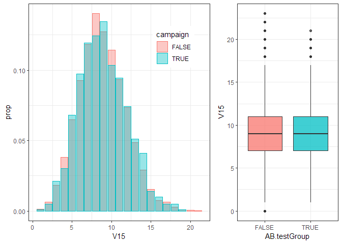<!-- -->

``` r
factorPlotList$V19
```

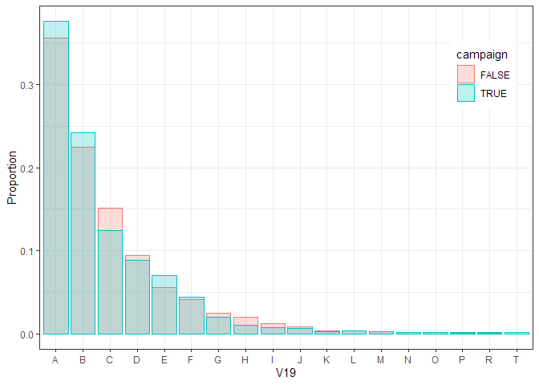<!-- -->

``` r
# table(pilot$campaign, pilot$V2) %>%
#   proportions(1)

# table(pilot$campaign, pilot$V19) %>%
#   proportions(1)
```

As in the comparison between the **users** and **pilot** datasets, the
latter dataset did not show visible differences in distributions among
the pilot groups.

### Tests

``` r
pilot %>%
    select(where(is.numeric)) %>%
    colnames() %>%
    sapply(
        function(X)
        {
            ks.test(
                pilot %>%
                    filter(campaign == TRUE) %>%
                    pull(X),
                pilot %>%
                    filter(campaign == FALSE) %>%
                    pull(X)
                )$p.value
        }
    ) %>%
    {
        Filter(function(x) x <= 0.05, .)    # Bonferonni correction might be applied 
    }                                       # (level of significance/number of tests)
```

    ## named numeric(0)

### Summary

The **pilot** dataset is also very clean, homogeneous and provided in
excellent quality. THe KS Test does not give us enough evidence to
reject the hypotheses about pairwise homogeneity of the pilot subsets.

# Pilot dataset exploration

As we were assured that the users subgroups was properly prepared for
the AB testing, we investigated the **pilot** dataset and did some
feature analysis.

``` r
pilot %>%
    mutate(outcome = paste0(c("R", "C")[1+campaign],            # Campaign presented? R - regular,  C - campaing        
                            c("N", "B")[1+purchase])) -> pilot  # Service bought?     N - not sold, B - sold

pilot$outcome %>%
    factor() -> pilot$outcome
```

## Does campaign work?

### Plots and test

We briefly analyzed the data visually and then performed the deeper
comparison.

``` r
pilot[,c("purchase", "campaign")] %>%
    table() -> pilotTable

pilotTable %>%
    as.data.frame() %>%
    add_column(groupPercentage = round(c(100 * .$Freq[1:2] / sum(.$Freq[1:2]),
                                     100 * .$Freq[3:4] / sum(.$Freq[3:4])), 2)) -> pilotTableDF
        
# print(pilotTableDF)
                       
ggplot(pilot) +
    geom_bar(aes(x = purchase, 
                 y =  ..prop..,
                 group = campaign,
                 fill = campaign,
                 colour = campaign),
             alpha = 0.4,
             stat = "count",
             position = "dodge") +
    geom_text(data = pilotTableDF, aes(x = c(1-0.45/2, 2-0.45/2, 1+0.45/2, 2+0.45/2), 
                                       y = groupPercentage/200, 
                                       label = paste(groupPercentage, "%"))) +
    labs(x = "Purchase", 
         y = "Proportion") +    
    theme(legend.position = c(0.8, 0.8))
```

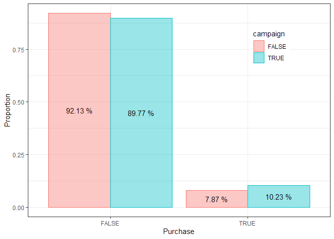<!-- -->

The numbers on the right bars are called conversion rates. The number on
the right red bar is called a **conversion baseline**. The main
objective of the AB testing is to check whether it raises significantly
after the change of the business process.

\[
Conversion := \frac{\#\lbrace\text{Data service purchased in group}\rbrace}{\#\lbrace\text{Clients in group}\rbrace}*100%
\]

We do not have any business information about the baseline conversion
among **COMPANY XYZ** users, but we could estimate it using the test
group. Let assume it is equal to 7.87%. If we assume a significance
level equal to 0.05, a power equal to 0.9, an estimated conversion rate,
and sample size of 5000 observations; we can detect conversion rate
changes over 22.6%. If the conversion rate in the **campaign group**
lays between 6.09% and 9.65% it will be undetectable in the conducted
experiment. Numbers above come from the AB testing methodology.

There is the visible improvement in conversion rate among **campaign
group**, the increase of 30 % is observed among users which were
threaten by the campaign.

The Chi-Squared test at a confidence level 0.95 was conducted to check
that intuition.

``` r
pilotTable %>%
    chisq.test(correct = FALSE) # sample size is large, there is no need for Yates correction
```

    ## 
    ##  Pearson's Chi-squared test
    ## 
    ## data:  .
    ## X-squared = 5.8234, df = 1, p-value = 0.01581

Thus, the hypothesis about homogeneity among the two groups is rejected.

Knowing that we proceed to a more advanced analysis. If the hypothesis
about homogeneity of two groups would be true, then there is no sense in
developing ML models for the provided data, as the campaign is making no
impact on users’ decisions.

*That might seems to be over-thinked, but building model to predict
something that do not exist is not a best practice. I read several
articles on AB testing and I believed it is a good idea to perform a
brief sanity check.*

### Profit/Loss

`deleted information`

``` r
pilotTable %>%
    {
        200*(.[2,2])-9*sum(.[,2])   
    }
```

    ## [1] 11427

We could conclude, that the pilot campaign was successful, and **COMPANY
XYZ** should expand the marketing campaign to more users.

*In deep analysis I should check that marketing campaign do not have
negative impact on users, i.e. there are no users which are less
interested in data service after campaign being presented.*

`deleted information`

### Additional evaluation metrics

As there is no detailed data provided by the **COMPANY XYZ** it is hard
to define additional evaluation metrics. The one was already used:

\[
Revenue := 200\cdot\#\lbrace\text{Data service purchased}\rbrace-9\cdot\#\lbrace\text{Campaign presented}\rbrace.
\]

## Visual exploration

We prepared a number of plots for a more detailed feature analysis. Only
those with most visible differences among groups are presented.

### Campaign and regular users

``` r
pilot %>%
    mutate_if(is.factor, as.numeric) %>%
    select(-campaign, -purchase) %>%
    cor %>%
    {
        .[order(abs(.[, 21]), decreasing = TRUE),
          order(abs(.[, 21]), decreasing = TRUE)]
    } %>%
    corrplot(method = "number", type = "upper", mar = c(0, 0, 1.5, 0),
             title = "Correlations between price and various features of diamonds")
```

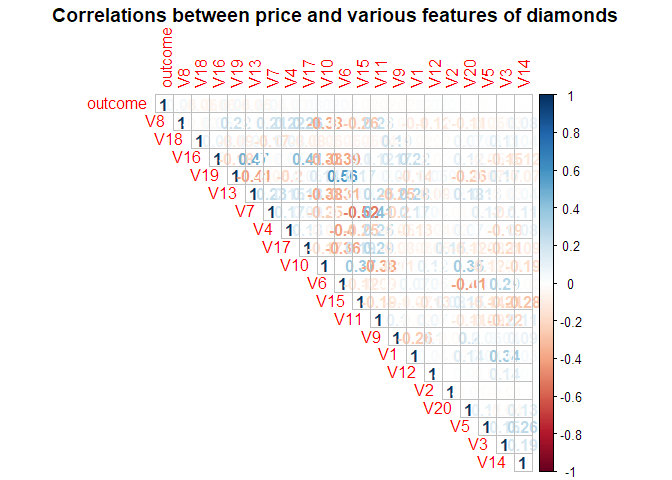<!-- -->

``` r
# continuous variables

plotDouble <- function(COLNAME)
{
    ggplot(pilot) +
        geom_histogram(aes(x = get(COLNAME), 
                           y = ..density.., 
                           fill = purchase,
                           colour = purchase),
                       alpha = 0.25,
                       stat = "bin",
                       bins = 34, # Rice rule
                       position = "identity") +
        labs(x = COLNAME,
             y = "Density",
             title = "Decomposition wrt purchase") +
        theme(legend.position = c(0.8, 0.8)) -> plot1
    
    ggplot(pilot) +
        geom_boxplot(aes(x = purchase, 
                         y = get(COLNAME),
                         fill = purchase),
                     alpha = 0.75) +
        labs(y = COLNAME) +
        guides(fill = "none") -> plot2
    
    plot_grid(plot1, plot2,  rel_widths = c(5, 3))
}

pilot %>%
    select(where(is.double)) %>%
    colnames() %>%
    sapply(
        function(X)
        {
            list(
                targeting = 
                    plotDouble(X),
                complete =  
                    ggplot(pilot) +
                    geom_histogram(aes(x = get(X),
                                       y = ..density..,
                                       fill = outcome),
                                   alpha = 0.25,
                                   colour = "black",
                                   stat = "bin",
                                   bins = 34) + # Rice rule)
                    geom_density(aes(x = get(X)),
                                 alpha = 0.5) +
                    labs(x = X,
                         y = "Density",
                         title = "Complete decomposition") +
                    facet_grid(rows = vars(purchase),
                               cols = vars(campaign),
                               labeller = label_both)
            )
        },
        simplify = FALSE,
        USE.NAMES = TRUE
    ) -> continousPlotList

continousPlotList$V4$targeting
```

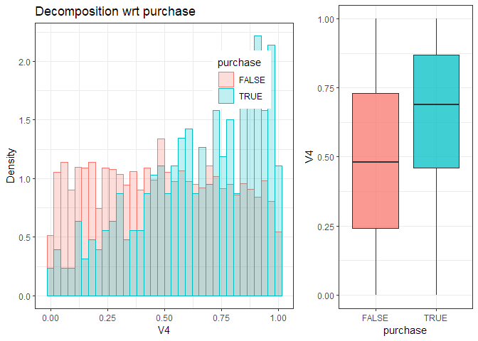<!-- -->

``` r
continousPlotList$V8$targeting
```

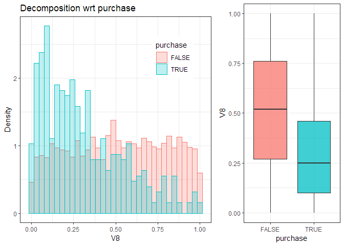<!-- -->

``` r
continousPlotList$V13$complete
```

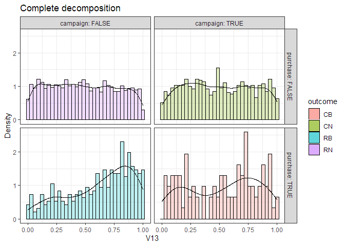<!-- -->

``` r
continousPlotList$V16$complete
```

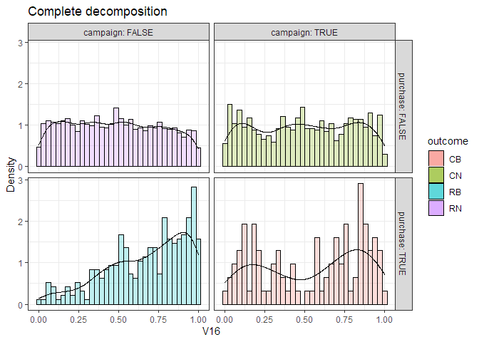<!-- -->

Variables **V4**, **V8**, **V13** and **V18** seem to have high impact
on users decisions. That might be interesting in terms of a business
approach, but we do not have detailed information about them. On the
**Complete decomposition** plots there is also visible difference
between users in campaign group, that is discussed later.

*At this step I could finish the visual analysis as it is not very
useful when I do not have business knowledge, but I wanted to be sure
that there is no obvious relationship between variables. Although
finally I did not use that knowledge, variables* **V13** *and* **V16**
*looked quite promising.*

``` r
# discrete variables

pilot %>%
    select(where(is.integer)) %>%
    colnames() %>%
    sapply(
        function(X)
        {
            list(targeting = 
                    ggplot(pilot) +
                    geom_bar(aes(x = get(X), 
                                 y = ..prop..,
                                 fill = purchase,
                                 colour = purchase),
                             alpha = 0.25,
                             position = "identity") +
                    labs(x = X,
                         y = "Density",
                         title = "Decomposition wrt purchase") +
                    facet_grid(cols = vars(campaign), labeller = label_both) +
                    theme(legend.position = c(0.9, 0.8)),
                 complete = 
                    ggplot(pilot) +
                    geom_bar(aes(x = get(X),
                                 y = ..prop..),
                             alpha = 0.25,
                             colour = "black") +
                    geom_density(aes(x = get(X)),
                                 alpha = 0.5) +
                    labs(x = X,
                         title = "Complete decomposition") +
                    facet_grid(rows = vars(purchase), 
                               cols = vars(campaign), 
                               labeller = label_both)
                 )
        },
        simplify = FALSE,
        USE.NAMES = TRUE
    ) -> discretePlotList

pilot %>%
    select(where(is.factor)) %>%
    colnames() %>%
    sapply(
        function(X)
        {
            ggplot(pilot) +
                geom_bar(aes(x = get(X),
                             y = ..prop..,
                             group = purchase,
                             fill = purchase,
                             colour = purchase),
                         alpha = 0.25,
                         position = "identity") +
                labs(x = X,
                     y = "Density",
                     title = "Decomposition wrt targeting") +
                facet_grid(cols = vars(campaign), 
                           labeller = label_both) +
                    theme(legend.position = c(0.9, 0.8))
        },
        simplify = FALSE,
        USE.NAMES = TRUE
    ) -> factorPlotList

# discretePlotList$V11$targeting
# discretePlotList$V15$targeting
factorPlotList$V19
```

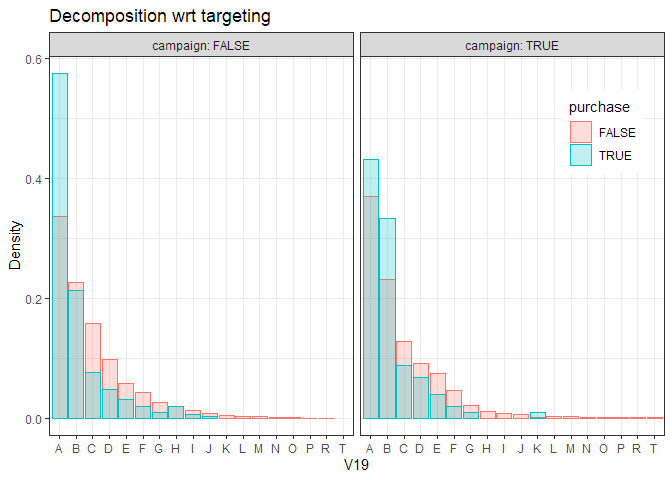<!-- -->

``` r
pilot$V19 %>%
    fct_collapse(other = levels(.)[-(1:6)]) -> pilot$V19

users$V19 %>%
    fct_collapse(other = levels(.)[-(1:6)]) -> users$V19
```

We grouped the variable **V19** as there are a few users in latter
groups.

### Campaign users

The data from the complete **pilot** dataset might ‘hide’ dependencies,
that is why a visual analysis is done one more time on a truncated
subset.

*There could be done a number of different comparisons, i.e:*

  - *users who bought service w/ campaign and users who bough w/o
    campaign;*
  - *users who did not buy w/ campaign and users who bough w/o campaign
    and many more;*

*but we believe it is out of the scope of this analysis.*

``` r
pilotCamp <- filter(pilot, campaign == TRUE)

# continuous variables

pilotCamp %>%
    select(where(is.double)) %>%
    colnames() %>%
    sapply(
        function(X)
        {
            ggplot(pilotCamp) +
                geom_histogram(aes(x = get(X), 
                                   y = ..density.., 
                                   fill = purchase,
                                   colour = purchase),
                               alpha = 0.25,
                               stat = "bin",
                               bins = 15, # Rice rule
                               position = "identity") +
                labs(x = X,
                     y = "Density",
                     title = "Campaign users") +
                theme(legend.position = c(0.9, 0.8))
        },
        simplify = FALSE,
        USE.NAMES = TRUE
    ) -> continousPlotList

# discrete variables

pilotCamp %>%
    select(where(is.integer)) %>%
    colnames() %>%
    sapply(
        function(X)
        {
            ggplot(pilotCamp) +
                geom_bar(aes(x = get(X), 
                             y = ..prop..,
                             fill = purchase,
                             colour = purchase),
                         alpha = 0.25,
                         position = "identity") +
                labs(x = X,
                     y = "Density",
                     title = "Campaign users") +
                theme(legend.position = c(0.9, 0.8))
        },
        simplify = FALSE,
        USE.NAMES = TRUE
    ) -> discretePlotList

pilotCamp %>%
    select(where(is.factor)) %>%
    colnames() %>%
    sapply(
        function(X)
        {
            ggplot(pilotCamp) +
                geom_bar(aes(x = get(X), 
                             y = ..prop..,
                             group = purchase,
                             fill = purchase,
                             colour = purchase),
                         alpha = 0.25,
                         position = "identity") +
                labs(x = X,
                     y = "Density",
                     title = "Campaign users") +
                theme(legend.position = c(0.9, 0.8))
        },
        simplify = FALSE,
        USE.NAMES = TRUE
    ) -> factorPlotList

continousPlotList$V4
```

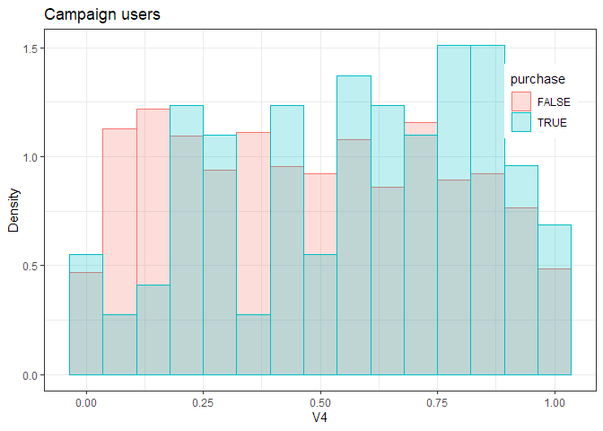<!-- -->

``` r
continousPlotList$V8
```

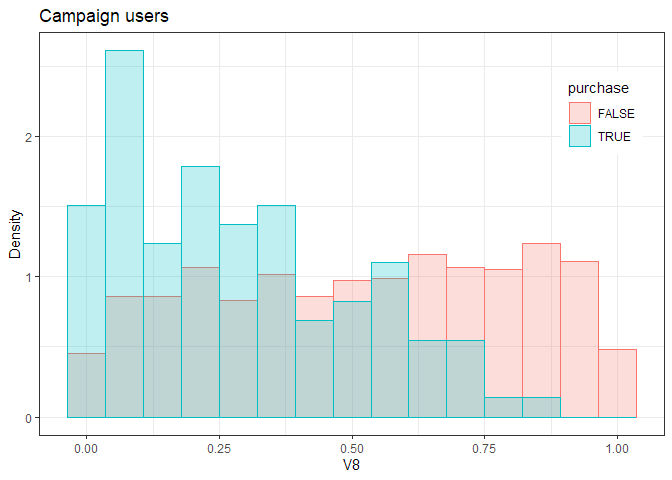<!-- -->

``` r
continousPlotList$V13
```

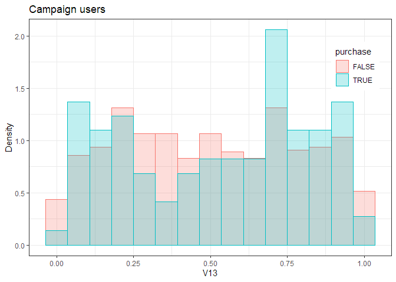<!-- -->

``` r
continousPlotList$V16
```

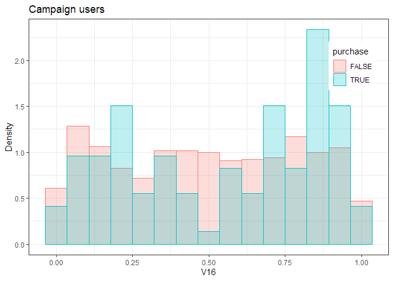<!-- -->

``` r
# continousPlotList$V20

# discretePlotList$V18
# discretePlotList$V15

# table(pilotCamp$campaign, pilotCamp$V2) %>%
#   proportions(1)
# table(pilotCamp$campaign, pilotCamp$V19) %>%
#   proportions(1)
```

Some of the differences among the distributions of variables in each
group was already visible at the plots based on the full **pilot**
dataset. We did not dive deeply into the feature engineering as this
could be extremely time consuming. An important fact is that there are
no outliers and, in general, the data is clean.

# Training

We have chosen two different approaches.

  - In the first, we build models on all provided data, where the
    outcome variable has four levels
      - **RN** - Regular users, did not buy;
      - **RB** - Regular users, did buy;
      - **CN** - Campaign users, did not but;
      - **CB** - Campaign users, did buy.
  - In the second approach, we build models only on campaign users, so
    the outcome variable has two levels
      - **success** - users did buy;
      - **fail** - otherwise;

At the begging we also prepared a third model, with two classes on full
dataset (**success** and **fail**), but that could bring many false
negatives - in the pilot group there are users, to whom campaign was not
presented, but they might be good choice for that.

*I used* **tidyverse** *packages for the modeling task. I have never
used them before, but I decided that this could be nice opportunity to
learn something. That is why everything took me a little bit longer than
I expected.* **tidymodels** *do not allow much customization and tuning
of models, but provides simple framework. The advanced tuning of the
models is rather done within their original packages, but in my case*
**tidyverse** *seems to be a good choice.*

There is just a few comments in following sections as the code seems to
be self exploratory. The first part present models build on whole pilot
dataset, the second present only on the **campaign** subset.

## Full data, four variables

### Data splitting

``` r
pilot %>%
    select(-campaign, -purchase) %>%
    initial_split(prop = .7, strata = outcome) -> pilotSplit

pilotSplit %>%
    training() %>%
    recipe(outcome ~ .) %>%
    step_dummy(all_predictors(), -all_numeric()) %>%
    step_scale(all_predictors()) %>%    # controversial
    step_center(all_predictors()) %>%   # ditto 
    step_smote(outcome) %>%             # imbalanced classes
    prep()-> pilotRecipe

pilotRecipe %>%
    bake(testing(pilotSplit)) -> pilotTest

pilotRecipe %>%
    juice() -> pilotTrain

pilotCVfold <- vfold_cv(pilotTrain, v = 10, repeats = 2, strata = outcome)
```

The data was sliced into training and test sets and prepared for a
cross-validation.

``` r
rand_forest() %>%
    set_mode("classification") %>%
    set_engine("ranger", importance = "impurity_corrected") %>%
    fit(outcome ~ ., data = pilotTrain) -> importanceCheckModel

ranger::importance(importanceCheckModel$fit) %>% 
    enframe("Variable", "Importance") %>%
    mutate(Variable = fct_reorder(Variable, Importance)) %>%
    arrange(desc(Importance)) %>% 
    ggplot(aes(x = Variable, y = Importance)) +
        geom_col() +
        coord_flip() +
        labs(title = "Variable Importance", subtitle = "Using 'ranger' library")
```

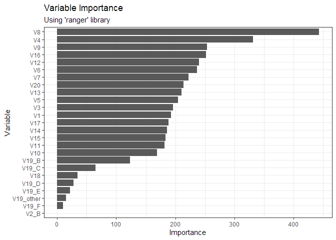<!-- -->

``` r
ranger::importance(importanceCheckModel$fit) %>% 
    enframe("Variable", "Importance") %>%
    mutate(Variable = fct_reorder(Variable, Importance)) %>%
    arrange(desc(Importance)) %>%
    filter(Importance > 100) %>%
    select(Variable) %>%
    unlist(use.names = FALSE) %>%
    as.character() -> importantVariables

importantVariablesFormula <- as.formula(paste("outcome ~ ", paste(importantVariables, collapse= "+")))
```

The simple random forest model was used to briefly analyze importance of
the exploratory variables. Some of them (**V4**, **V6**, **V13**,
**V16**, **V11** and **V7**) corresponds with those chosen during the
feature engineering.

### GLM

The first model is **generalized linear model**, we used build-in cross
validation to chose the best lambda parameter.

``` r
multinom_reg() %>%
    set_mode("classification") %>%
    set_engine("glmnet") %>%
    # fit(importantVariablesFormula, data = pilotTrain) -> glmModel
    fit(outcome ~ ., data = pilotTrain) -> glmModel

cv.glmnet(x = as.matrix(select(pilotTrain, -outcome)), 
          y = pilotTrain$outcome, family = "multinomial",
          type.measure="class") -> cvGLM

# plot(glmModel$fit, xvar = "dev", label = TRUE)
# plot(cvGLM)

list("min" = cvGLM$lambda.1se -> temp, "1.5*min" = 2*temp, "0.75*min" = 0.5*temp) %>%
    sapply(
        function(X)
        {
            list(coefMatrix = 
                    glmModel %>%
                    predict(pilotTest, penalty = X) %>%
                    bind_cols(pilotTest) %>%
                    select(.pred_class, outcome) %>%
                    conf_mat(truth = outcome, estimate = .pred_class) -> temp,
                 plot = 
                    temp %>%
                    autoplot(type = "heatmap") +
                        ggtitle(paste("Lambda equal to", X))
            )
        },
        simplify = FALSE,
        USE.NAMES = TRUE
    ) -> glmNetCompare


# glmNetCompare[[1]]$coefMatrix %>%
#   summary()

glmNetCompare[[1]]$plot
```

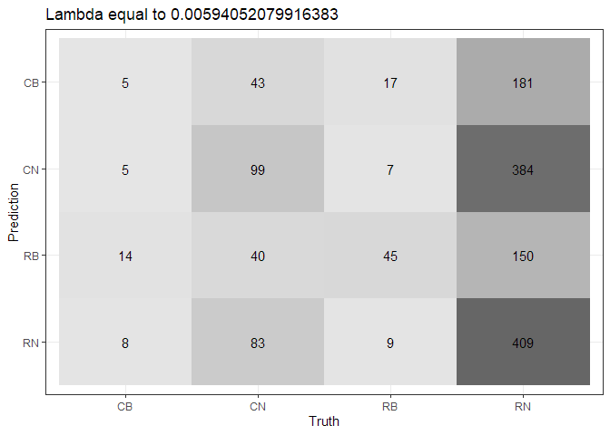<!-- -->

``` r
# translate(glmModel$spec)
```

`deleted information`

``` r
glmNetCompare[[1]]$coefMatrix$table %>%
    {
        200*sum(.[c(1,3), c(1,3)])-9*sum(.[(1:3), ])    
    }


glmNetCompare[[1]]$coefMatrix$table %>%
    {
        200*sum(.[1, c(1,3)])-9*sum(.[c(1,3), ])    
    }
```

    ## [1] 7290
    ## [1] -55

The way of calculating revenue in this case needs to be discussed.
Should **COMPANY XYZ** present campaign to users which are likely to buy
new service? Will they change their minds? should **COMPANY XYZ**
present campaign only to users labeled as **CB**? There are many
questions which needs more business insight.

### xgBoost

`deleted information`

``` r
boost_tree(trees = 1000,
           mtry = tune(),
           min_n = tune(),
           tree_depth = tune(), 
           learn_rate = tune(),
           loss_reduction = tune(),
           sample_size = tune()) %>%
    set_mode("classification") %>%
    set_engine("xgboost") -> XGbModel

grid_latin_hypercube(tree_depth(),
                     min_n(),
                     loss_reduction(),
                     sample_size = sample_prop(),
                     finalize(mtry(), pilotTrain),
                     learn_rate(),
                     size = 45) -> XGbGrid

workflow() %>% 
    add_formula(outcome ~ .) %>%    # each dataset is already prepared
    add_model(XGbModel) -> XGbWorkflow


doParallel::registerDoParallel()

tune_grid(XGbWorkflow,
          resamples = pilotCVfold,
          grid = XGbGrid,
          metrics = metric_set(accuracy, ppv, kap, roc_auc),
          control = control_grid(save_pred = TRUE)) -> XGbTuneResults

unique(XGbTuneResults$.metrics[[1]]$.metric) %>%
    sapply(function(X) 
        {
            list(plot = 
                    XGbTuneResults %>%
                    collect_metrics() %>%
                    filter(.metric == X) %>%
                    select(mean, mtry:sample_size) %>%
                    pivot_longer(mtry:sample_size,
                                 values_to = "value",
                                 names_to = "parameter"
                                 ) %>%
                    ggplot(aes(value, mean, color = parameter)) +
                    geom_point(alpha = 0.8, show.legend = FALSE) +
                    facet_wrap(~parameter, scales = "free_x") +
                    labs(x = NULL, y = X),
                 bestModel =
                    select_best(XGbTuneResults, X)
                 )
        },
        simplify = FALSE,
        USE.NAMES = TRUE) -> XGbBestModels

do.call("rbind", flatten(XGbBestModels)[2*1:4]) %>%
    bind_cols(metric = names(XGbBestModels)) %>%
    remove_rownames() %>%
    column_to_rownames(var = "metric") -> XGbBestHP

write.csv(XGbBestHP, file = "02 Workspace/HypeparametarsXGBoost10.csv")

saveRDS(XGbWorkflow, file = "02 Workspace/XGbWorkflow.rds")
saveRDS(XGbBestModels, file = "02 Workspace/XGbBestModels.rds")
```

``` r
XGbWorkflow <- readRDS("02 Workspace/XGBWorkflow.rds")
XGbBestModels <- readRDS("02 Workspace/XGbBestModels.rds")

XGbFinalModel <- XGbBestModels$accuracy$bestModel

finalXGbWorkflow <- finalize_workflow(XGbWorkflow,
                                      XGbFinalModel)

finalXGbWorkflow %>%
    fit(data = pilotTrain) %>%
    pull_workflow_fit() %>%
    vip(geom = "point")
```

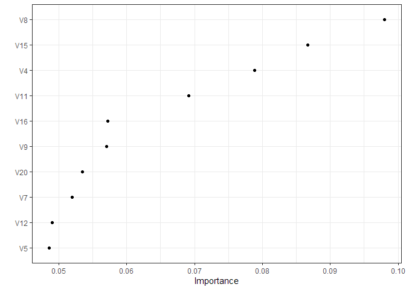<!-- -->

``` r
finalXGbResults <- last_fit(finalXGbWorkflow, 
                            pilotSplit,
                            metrics = metric_set(accuracy, ppv, kap, roc_auc))

# translate(finalXGbResults$.workflow[[1]]$fit$fit$spec)

# collect_metrics(finalXGbResults)

finalXGbResults$.predictions[[1]] %>%
    select(prediction = .pred_class, outcome) %>%
    conf_mat(truth = outcome, estimate = prediction) %>%
    autoplot(type = "heatmap") +
    labs(title = "xgBoost")
```

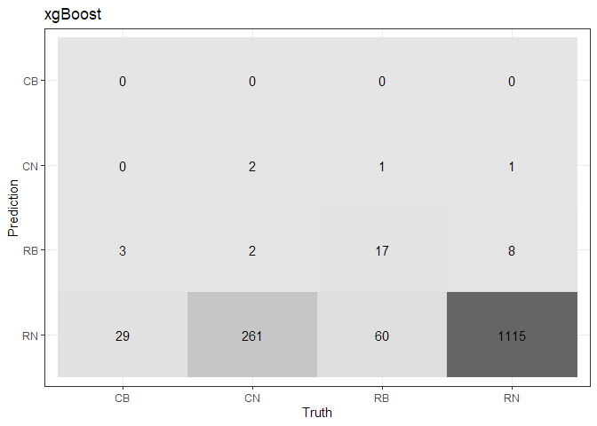<!-- -->

It turned out that for the first approach **xgBoost** is probably
overfitting. There should be done more, but training the xgBoost model
on a local machine takes a lot of time and is not efficient. We left
this approach and continue with the more promising one, where the model
is trained only on **campaign** subset.

## Campaign data, two variables

Steps are almost same as in the **full** training.

### Data splitting

``` r
pilot %>%
    filter(campaign) %>%
    select(-campaign, -purchase) -> pilotPrepBinary

pilotPrepBinary$outcome %>%
    fct_recode(fail = "CN") %>%
    fct_recode(success = "CB") %>%
    fct_drop() -> pilotPrepBinary$outcome

pilotPrepBinary %>%
    initial_split(prop = .7, strata = outcome) -> pilotSplitBinary

pilotSplitBinary %>%
    training() %>%
    recipe(outcome ~ .) %>%
    step_dummy(all_predictors(), -all_numeric()) %>%
    step_scale(all_predictors()) %>%
    step_upsample(outcome) %>%
    prep() -> pilotRecipeBinary

pilotRecipeBinary %>%
    bake(testing(pilotSplitBinary)) -> pilotTestBinary

pilotRecipeBinary %>%
    juice() -> pilotTrainBinary

pilotCVfoldBinary <- vfold_cv(pilotTrainBinary, v = 10, repeats = 2, strata = outcome)
```

``` r
rand_forest() %>%
    set_mode("classification") %>%
    set_engine("ranger", importance = "impurity_corrected") %>%
    fit(outcome ~ ., data = pilotTrainBinary) -> importanceCheckModelBinary

ranger::importance(importanceCheckModelBinary$fit) %>% 
    enframe("Variable", "Importance") %>%
    mutate(Variable = fct_reorder(Variable, Importance)) %>%
    arrange(desc(Importance)) %>% 
    ggplot(aes(x = Variable, y = Importance)) +
        geom_col() +
        coord_flip() +
        labs(title = "Variable Importance in the binary approach", subtitle = "Using 'ranger' library")
```

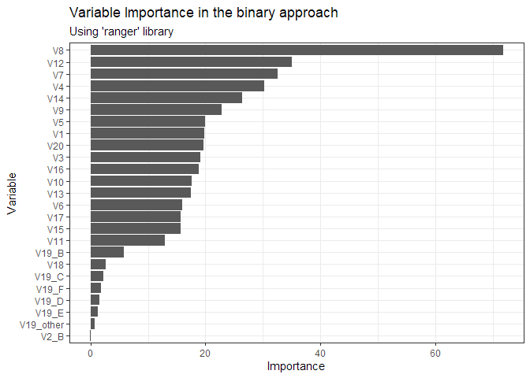<!-- -->

``` r
ranger::importance(importanceCheckModelBinary$fit) %>% 
    enframe("Variable", "Importance") %>%
    mutate(Variable = fct_reorder(Variable, Importance)) %>%
    arrange(desc(Importance)) %>%
    slice(1:17) %>%
    select(Variable) %>%
    unlist(use.names = FALSE) %>%
    as.character() -> importantVariablesBinary

importantVariablesFormulaBinary <- as.formula(paste("outcome ~ ", paste(importantVariablesBinary, collapse= "+")))
```

``` r
logistic_reg() %>%
    set_mode("classification") %>%
    set_engine("glmnet") %>%
    # fit(outcome ~ ., data = pilotTrainBinary) -> glmModelBinary
    fit(importantVariablesFormulaBinary, data = pilotTrainBinary) -> glmModelBinary

cv.glmnet(x = as.matrix(select(pilotTrainBinary, importantVariablesBinary)),
# cv.glmnet(x = as.matrix(select(pilotTrainBinary, -outcome)),
          y = pilotTrainBinary$outcome, family = "binomial",
          type.measure="class") -> cvGLMBinary

# plot(glmModelBinary$fit, xvar = "dev", label = TRUE)
# plot(cvGLM)

list("min" = cvGLMBinary$lambda.1se -> temp, "2*min" = 2*temp, "0.5*min" = 0.5*temp) %>%
    sapply(
        function(X)
        {
            list(coefMatrix = 
                    glmModelBinary %>%
                    predict(pilotTestBinary, penalty = X) %>%
                    bind_cols(pilotTestBinary) %>%
                    select(.pred_class, outcome) %>%
                    conf_mat(truth = outcome, estimate = .pred_class) -> temp,
                 plot = 
                    temp %>%
                    autoplot(type = "heatmap") +
                        labs(title = "GLM",
                             subtitle = paste("Lambda equal to", X)) 
                 )
        },
        simplify = FALSE,
        USE.NAMES = TRUE
    ) -> glmNetCompareBinary

# glmNetCompareBinary[[1]]$coefMatrix %>%
#   summary()

glmNetCompareBinary[[1]]$plot
```

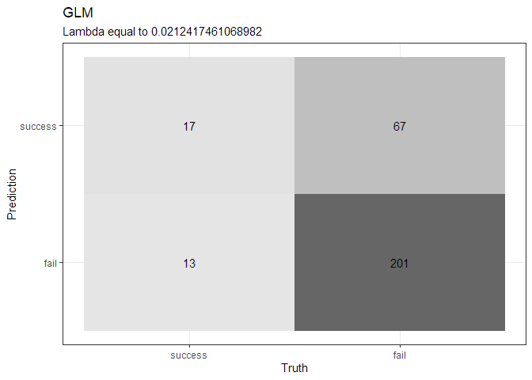<!-- -->

As in the GLM for the full data, the hypothetical revenue was
calculated.

``` r
glmNetCompareBinary[[1]]$coefMatrix$table %>%
    {
        200*(.[1,1])-9*sum(.[1, ])  
    }
```

    ## [1] 2644

### xgBoost

``` r
boost_tree(trees = 1000,
           mtry = tune(),
           min_n = tune(),
           tree_depth = tune(), 
           learn_rate = tune(),
           loss_reduction = tune(),
           sample_size = tune()) %>%
    set_mode("classification") %>%
    set_engine("xgboost") -> XGbModelBinary

grid_latin_hypercube(tree_depth(),
                     min_n(),
                     loss_reduction(),
                     sample_size = sample_prop(),
                     finalize(mtry(), pilotTrainBinary),
                     learn_rate(),
                     size = 45) -> XGbGridBinary

workflow() %>% 
    # add_recipe(pilotRecipe) %>%
    add_formula(outcome ~ .) %>%    # each dataset is already prepared
    add_model(XGbModelBinary) -> XGbWorkflowBinary


doParallel::registerDoParallel()

tune_grid(XGbWorkflowBinary,
          resamples = pilotCVfoldBinary,
          grid = XGbGridBinary,
          metrics = metric_set(accuracy, roc_auc, sensitivity, specificity, precision),
          control = control_grid(save_pred = TRUE)) -> XGbTuneResultsBinary

autoplot(XGbTuneResultsBinary)

for (i in 1:length(XGbTuneResultsBinary$.metrics))  # bug in {tune} package, "spec" and "sens" 
{                                                   # are not properly recognized by is_metric function
    XGbTuneResultsBinary$.metrics[[i]]$.metric %>%
        recode(sens = "sensitivity") -> XGbTuneResultsBinary$.metrics[[i]]$.metric
    
    XGbTuneResultsBinary$.metrics[[i]]$.metric %>%
        recode(spec = "specificity") -> XGbTuneResultsBinary$.metrics[[i]]$.metric
}

unique(XGbTuneResultsBinary$.metrics[[1]]$.metric) %>%
    sapply(function(X) 
        {
            list(plotImportance = 
                    XGbTuneResultsBinary %>%
                    collect_metrics() %>%
                    filter(.metric == X) %>%
                    select(mean, mtry:sample_size) %>%
                    pivot_longer(mtry:sample_size,
                                 values_to = "value",
                                 names_to = "parameter"
                                 ) %>%
                    ggplot(aes(value, mean, color = parameter)) +
                    geom_point(alpha = 0.8, show.legend = FALSE) +
                    facet_wrap(~parameter, scales = "free_x") +
                    labs(x = NULL, y = X),
                 bestModel =
                    select_best(XGbTuneResultsBinary, X)
                 )
        },
        simplify = FALSE,
        USE.NAMES = TRUE) -> XGbBestModelsBinary

do.call("rbind", flatten(XGbBestModelsBinary)[2*1:6]) %>%
    bind_cols(metric = names(XGbBestModelsBinary)) %>%
    remove_rownames() %>%
    column_to_rownames(var = "metric") -> XGbBestHPBinary

write.csv(XGbBestHPBinary, file = "02 Workspace/HypeparametarsXGBoostBinary.csv")

saveRDS(XGbWorkflowBinary, file = "02 Workspace/XGbWorkflowBinary.rds")
saveRDS(XGbBestModelsBinary, file = "02 Workspace/XGbBestModelsBinary.rds")
```

``` r
XGbWorkflowBinary <- readRDS("02 Workspace/XGbWorkflowBinary.rds")
XGbBestModelsBinary <- readRDS("02 Workspace/XGbBestModelsBinary.rds")

XGbFinalModelBinary <- XGbBestModelsBinary$accuracy$bestModel

finalXGbWorkflowBinary <- finalize_workflow(XGbWorkflowBinary,
                                            XGbFinalModelBinary)

finalXGbWorkflowBinary %>%
    fit(data = pilotTrainBinary) %>%
    pull_workflow_fit() %>%
    vip(geom = "point")
```

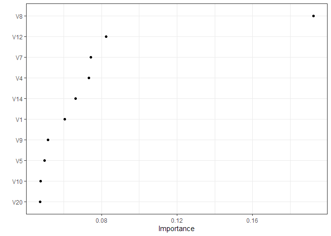<!-- -->

``` r
finalXGbResultsBinary <- last_fit(finalXGbWorkflowBinary, 
                                  pilotSplitBinary,
                                  metrics = metric_set(accuracy, roc_auc, sensitivity, specificity, precision))

# finalXGbResultsBinary$.predictions[[1]] %>%
#   # mutate(prediction = fct_shift(factor(c("fail", "success")[1+(.pred_success >= 0.4999991)]))) %>%
#   select(prediction = .pred_class, outcome) %>%
#   sensitivity(truth = outcome, estimate = prediction)

# translate(finalXGbResultsBinary$.workflow[[1]]$fit$fit$spec)

finalXGbResultsBinary$.predictions[[1]] %>%
    mutate(prediction = fct_shift(factor(c("fail", "success")[1+(.pred_success >= 0.4999991)]))) %>%
    # select(prediction = .pred_class, outcome) %>%
    select(prediction, outcome) %>%
    conf_mat(truth = outcome, estimate = prediction) -> XGbCoefTable

XGbCoefTable %>%
    autoplot(type = "heatmap") +
    labs(title = "xgBoost")
```

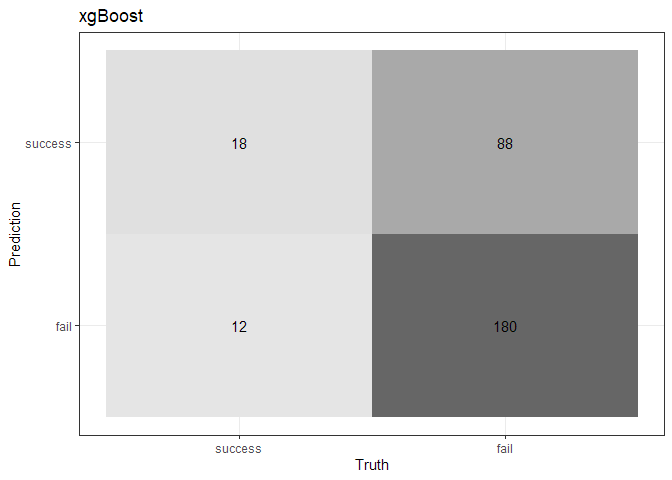<!-- -->

``` r
XGbCoefTable$table %>%  # Revenue
    {
        100*(.[1,1])-5*sum(.[1, ])  
    }
```

    ## [1] 1270

The **xgBoost** model do not works very well on a default cut-off level
for **success**, but it could be modified and in that case results are
similar to GLM-based model.

## Summary

We developed four models in two different approaches. One of them
(xgBoost on full data) seems to be totally unusable without diving into
**technicals**, other three gives promising results, but they require a
lot of tuning.

Approach to build model on **campaign** data seems to be better choice
as the underlying model do not observe data which may add a bias.

`deleted information`

It seems that good performance metrics for the task are **sensitivity**
and **precision**, but the final choice depends on the business
objective of the **COMPANY XYZ**.

# Predictions

``` r
predictions <- tibble(.rows = nrow(users))

pilotRecipe %>%
    bake(users) -> usersBaked

finalXGbWorkflowBinary %>%
    fit(pilotTrainBinary) -> XGbtrainedBinary

# not optimized, 6 calls to predict function...
predictions %>% 
    add_column(GLM_full_prob  = predict(glmModel, usersBaked, 
                                        penalty = cvGLM$lambda.1se, type = "prob")$.pred_CB) %>%
    add_column(GLM_camp_class  = predict(glmModelBinary, usersBaked, 
                                        penalty = cvGLMBinary$lambda.1se, type = "class")$.pred_class) %>%
    add_column(GLM_camp_prob  = predict(glmModelBinary, usersBaked, 
                                        penalty = cvGLMBinary$lambda.1se, type = "prob")$.pred_success) %>%
    add_column(XGb_camp_class = predict(XGbtrainedBinary, usersBaked,
                                        type = "class")$.pred_class) %>%
    add_column(XGb_camp_prob = predict(XGbtrainedBinary, usersBaked, 
                                       type = "prob")$.pred_success) -> predictions
# predictions %>%
#   select(GLM_camp_class, XGb_camp_class) %>%
#   select(GLM_camp_class) %>%
#   select(XGb_camp_class) %>%
#   table()

predictions %>%
    select(ends_with("prob")) %>%
    mutate_all(funs(. > sort(., decreasing = TRUE)[nrow(predictions)/4])) -> predictionsPrepared
    
predictionsPrepared %>%
    filter(GLM_camp_prob == XGb_camp_prob) %>%
    select(GLM_camp_prob) %>%
    table()

predictionsPrepared %>%
    mutate(crazyIdea = GLM_full_prob + GLM_camp_prob + XGb_camp_prob) %>%
    mutate(crazyIdea = (crazyIdea>1)) %>%
    mutate_all(funs(as.integer(.))) %>%
    select(GLM_camp_prob, everything())-> predictionsFinal

write.csv(predictionsFinal$GLM_camp_prob, file = "03 Deliverables/MM_01_decisionsSimple.csv")
write.csv(predictionsFinal, file = "03 Deliverables/MM_02_decisions.csv")
```

    ## .
    ## FALSE  TRUE 
    ## 61857  7526

The last code chunk showed that models are not homogeneous in the
decisions. That might be sign of an overfitting, some data dependencies
which we do not explore, or a bad model optimization.

With default parameters **xgBoost** model is much more conservative than
GLM model.

`deleted information`

For final prediction we used data from the **GLM** model, but as stated
before, there should be done a lot more in terms of the model tuning.

`deleted information`

*There are many things in this report which can be handled differently,
sometimes better, but I decided not to spend too much time on every
aspect of the task. I tried to present my coding skills, attitude to
data exploration, models development and overall approach to solving
problems like this. I did not focus much on looking for relationships in
the data, choosing best models and tweaking them. Probably simple
logistic regression would obtain similar results but I do not want to
expand the report, it seems to be already long. I indicated problems
with the analysis in the comments.*
